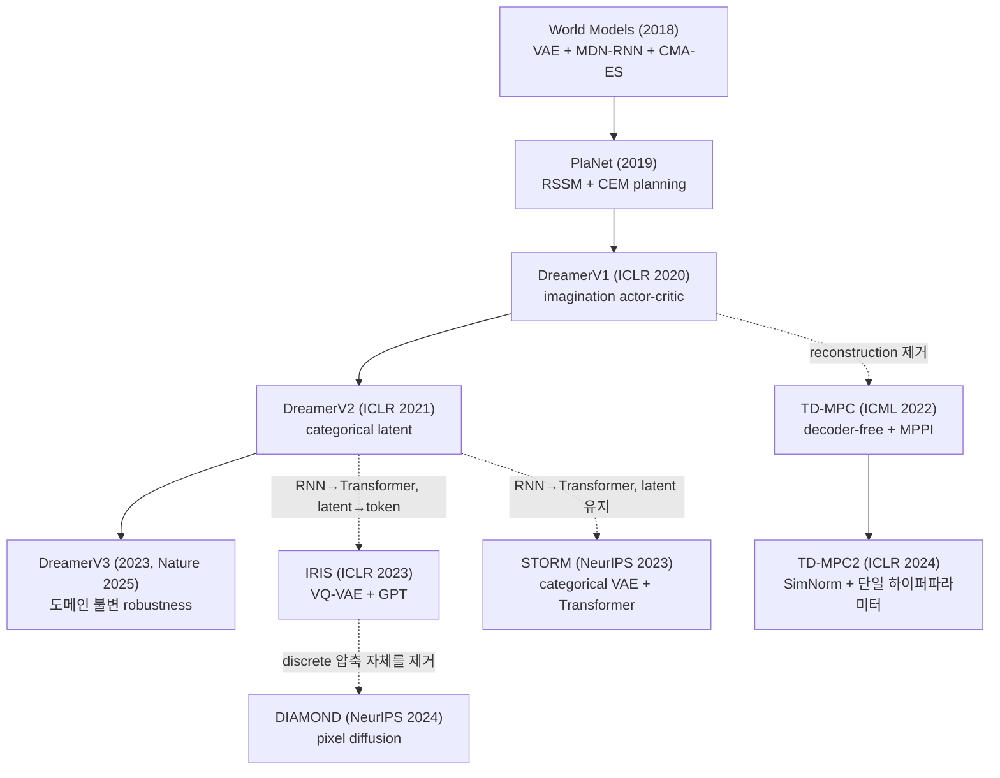
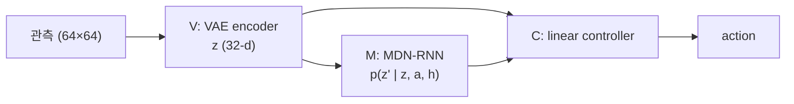
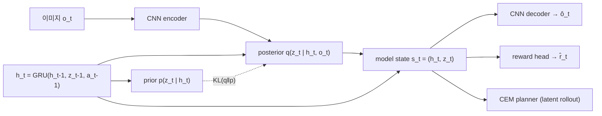
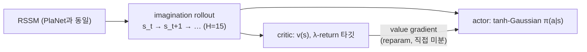
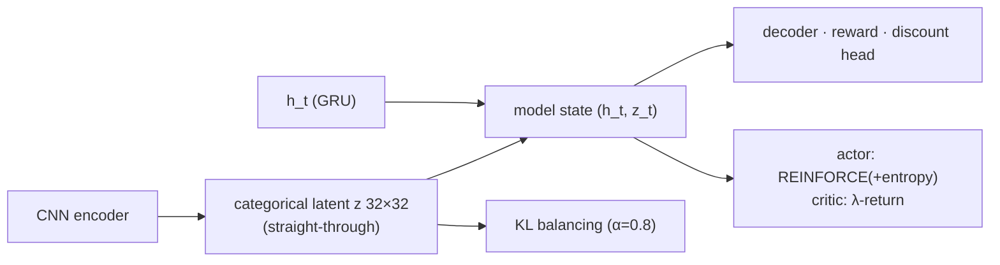
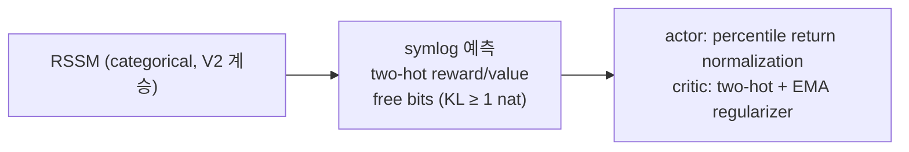
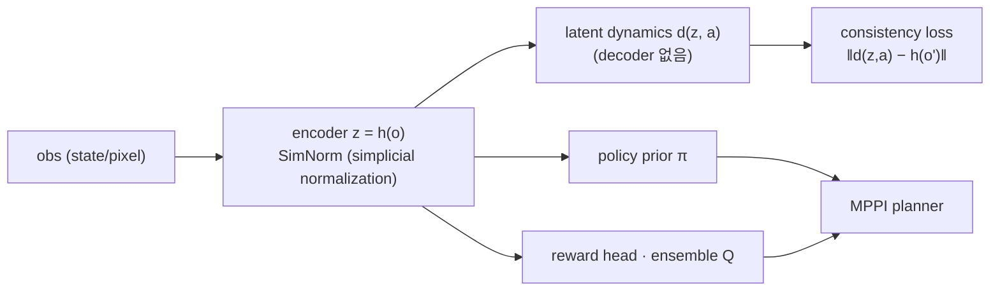
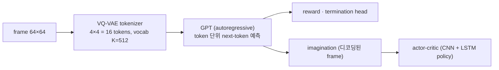
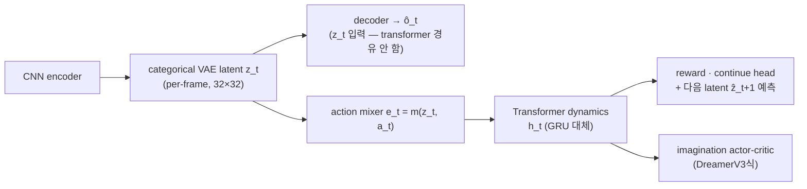
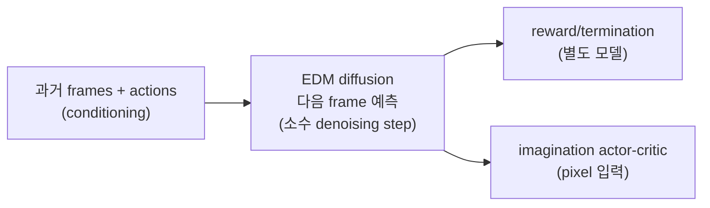

# World Model 계보 서베이 (Task 1 산출물)

> 구현 대상 9개 알고리즘의 계보 정리. 각 항목: 핵심 기여 1줄 → 아키텍처 → 선행 대비 diff.
> 점수 타깃은 `docs/TARGETS.md` 참조. 보조 자료: tsinghua-fib-lab/World-Model survey repo.

## 계보 한눈에 보기

세 갈래 분기 구조:

- **본류 (recurrent latent)**: PlaNet → DreamerV1 → V2 → V3. RSSM을 유지하며 latent 표현·학습 안정성을 개선.
- **reconstruction-free 분기**: TD-MPC/TD-MPC2. decoder를 버리고 control에 필요한 표현만 학습, planning 부활.
- **Transformer/생성모델 분기**: IRIS·STORM(시퀀스 모델 교체), DIAMOND(latent 압축 자체를 제거).

---

## 1. World Models — Ha & Schmidhuber 2018 (arXiv:1803.10122)

**핵심 기여**: 학습된 생성 모델 내부("dream")에서만 정책을 훈련해 실제 환경으로 전이 가능함을 처음 실증.

- V(VAE)·M(MDN-RNN)·C(controller) 3단 분리 학습. C는 파라미터 수백 개를 CMA-ES로 진화 탐색.
- 한계: 모델·정책이 단절 학습(iterative training 미흡), 단순 환경(CarRacing, VizDoom)에 국한. 이 한계가 PlaNet/Dreamer의 출발점.

## 2. PlaNet — Hafner et al. 2019 (arXiv:1811.04551, "Learning Latent Dynamics for Planning from Pixels")

**핵심 기여**: **RSSM** 제안 — deterministic 경로(GRU)와 stochastic latent를 결합한 recurrent state-space model로, 픽셀에서 latent space planning(CEM)만으로 연속 제어 달성.

주의(Task 4 구현 직결): decoder·reward head의 입력은 stochastic latent 단독이 아니라 **(h_t, z_t) concat인 model state**다.

**vs World Models**: 분리된 VAE+RNN → 단일 시퀀스 모델(RSSM)로 통합, end-to-end ELBO 학습. deterministic+stochastic 혼합 경로가 장기 예측 안정성의 핵심. policy 없이 매 step CEM 재계획.

- 손실: reconstruction NLL + reward NLL + KL(posterior‖prior), free nats로 KL 하한.
- **latent overshooting**: 1-step KL 외에 multi-step 예측 분포에도 KL을 거는 정규화. Dreamer v1부터는 폐기되었으나, **Task 4는 PlaNet 충실 재현을 위해 채택하기로 결정 (사용자 확인됨)** — dreamer 계열로 승격 시 비활성화.
- 하이퍼파라미터: 원문 부록 (별도 테이블 번호는 구현 착수 시 확인).
- 본 프로젝트의 Task 4가 이 RSSM을 단독 구현·검증한다.

## 3. DreamerV1 — Hafner et al. ICLR 2020 (arXiv:1912.01603, "Dream to Control")

**핵심 기여**: planning을 학습된 actor-critic으로 대체 — imagination rollout(H=15)에서 **dynamics를 통한 직접 backprop**으로 actor를 학습.

**vs PlaNet**: CEM planner 제거 → amortized policy. 연속 latent·연속 action이 모두 reparameterized라 reward-to-go를 dynamics 통째로 미분 가능(REINFORCE 불필요). λ-return으로 H 너머 가치 부트스트랩.

- 예상 함정(로드맵 Task 5): value 타깃 detach, imagination 시작 state의 terminal 제외, action repeat 2.
- 원문 실험: 5 seeds (TARGETS.md의 V1 수치 출처 관련). 하이퍼파라미터: 원문 부록 (별도 테이블 번호는 구현 착수 시 확인).

## 4. DreamerV2 — Hafner et al. ICLR 2021 (arXiv:2010.02193, "Mastering Atari with Discrete World Models")

**핵심 기여**: stochastic latent를 Gaussian → **32×32 categorical**(straight-through gradient)로 교체해 world model 기반 에이전트 최초로 Atari에서 human-level 달성.

주의: 모든 head의 입력은 (h_t, z_t) concat인 model state (PlaNet과 동일).

**vs DreamerV1 diff**:

- latent: Gaussian → categorical 32×32 + straight-through (multimodal 표현, gradient 소실 완화)
- KL balancing: `α·KL(sg(q)‖p) + (1−α)·KL(q‖sg(p))`, α=0.8 — prior 쪽 항을 더 빠르게 최소화해 **prior 학습 가속** (덜 학습된 prior 쪽으로 representation이 정규화되는 것을 방지)
- actor 학습: 연속 미분 불가(discrete action) → REINFORCE 주축. dynamics backprop과의 혼합 비율이 하이퍼파라미터로 존재하나 원문 부록은 "혼합은 이득이 미미, Atari는 REINFORCE 단독"이라 보고
- discount(continue) head 추가로 episode 종료 예측
- 하이퍼파라미터: 원문 Appendix D (KL scale β=0.1, α=0.8, H=15 등)

## 5. DreamerV3 — Hafner et al. 2023 (arXiv:2301.04104, Nature 2025, "Mastering Diverse Domains through World Models")

**핵심 기여**: 도메인별 튜닝 없이 **단일 하이퍼파라미터 셋**으로 150+ 태스크를 푸는 robustness 기법 모음 — symlog, two-hot, free bits, return normalization.

**vs DreamerV2 diff**:

- 관측/reward/value 스케일 불변화: symlog 변환 + two-hot discrete regression
- KL이 dynamics/representation 2개 항으로 분리: `L_dyn = KL(sg(q)‖p)`, `L_rep = KL(q‖sg(p))`에 **각각 free bits(1 nat 하한)** 적용 후 β_dyn=1.0, β_rep=0.1 가중 (Nature/arXiv v2 기준 — v2 하이퍼파라미터 표에서 확인; V2의 α 혼합식 대체)
- **unimix**: 모든 categorical 분포에 1% uniform 혼합 (zero-probability 방지, 원문 확인)
- return을 5–95 percentile로 정규화해 entropy 계수 고정 가능
- critic EMA regularizer, 높은 replay ratio 등 학습 안정화
- 구현 기준은 Nature 2025 버전 세부사항 (로드맵 Task 7)
- 하이퍼파라미터: arXiv v2 부록 "Hyperparameters" 표 (RMSNorm+SiLU, LaProp, B=16, T=64 등)

## 6. TD-MPC → TD-MPC2 — Hansen et al. ICML 2022 / ICLR 2024 (arXiv:2203.04955 / 2310.16828)

**핵심 기여 (TD-MPC)**: decoder 없는 **implicit world model** — reconstruction 대신 latent consistency·reward·value 예측만으로 control-centric 표현 학습, MPPI planning 부활.
**핵심 기여 (TD-MPC2)**: SimNorm latent·ensemble Q·discrete regression으로 104개 태스크 단일 하이퍼파라미터 + 모델/데이터 스케일링 실증.

**vs Dreamer 계열**: ① 생성 모델 아님 — open-loop 픽셀 예측 불가(검증은 latent consistency·reward MSE로), ② planning(MPPI)이 1차 행동 결정자, policy는 proposal prior, ③ 표현이 task-relevant 정보만 압축 — decoder 유무가 표현 학습에 미치는 영향이 Task 8 관찰 포인트.

**TD-MPC2 vs TD-MPC diff** (원문 Appendix A 기준): ① latent **무제약(정규화 없음**, ELU MLP — exploding gradient 원인) → SimNorm(소프트맥스 심플렉스 묶음) + 전 레이어 LayerNorm/Mish, ② Q 2개 → ensemble 5 + 1% Dropout (TD-target은 랜덤 2개 min), ③ reward/value의 continuous regression → log 공간 discrete regression(soft cross-entropy), ④ policy prior: deterministic+Gaussian noise → maximum-entropy(SAC식) stochastic policy, ⑤ 태스크 임베딩으로 멀티태스크.

- 하이퍼파라미터: 원문 Table 8 (env별 action repeat 등은 Table 6).

## 7. IRIS — Micheli et al. ICLR 2023 (arXiv:2209.00588, "Transformers are Sample-Efficient World Models")

**핵심 기여**: 이미지를 **VQ-VAE 토큰**으로, dynamics를 **GPT autoregressive**로 — 언어 모델 레시피를 world model에 이식해 Atari 100k에서 표본 효율 실증.

**vs DreamerV2**: ① latent가 per-frame 1개 벡터 → per-patch 16 tokens (공간 구조 보존), ② GRU → Transformer (긴 context, 병렬 학습), ③ posterior/prior KL 구조 없음 — 토크나이저와 dynamics가 완전 분리 2-stage 학습, ④ policy가 latent가 아닌 디코딩된 픽셀을 입력으로 받는 **CNN + LSTM**(recurrent, hidden 512).

- 함정 예고(Task 9): 토크나이저 품질이 상한 — 토크나이저 단독 reconstruction 검증을 먼저 할 것. imagination이 token 단위라 frame당 16 forward → 느림.
- 하이퍼파라미터: 원문 Tables 2–6 (encoder/decoder, embedding K=512, Transformer, 학습 루프, RL).

## 8. STORM — Zhang et al. NeurIPS 2023 (arXiv:2310.09615, "Efficient Stochastic Transformer based World Models")

**핵심 기여**: DreamerV3식 **categorical stochastic latent(per-frame)** 를 유지한 채 시퀀스 모델만 Transformer로 교체 — IRIS 대비 학습 효율과 점수 모두 개선.

주의: 원문 확인 결과 decoder는 **encoder의 posterior 샘플 z_t에서 직접 재구성**한다 (`ô_t = p_φ(z_t)`). transformer hidden에서 재구성하는 변형은 원문 ablation의 "Decoder at rear" 구성이며 기본이 아님. KL은 DreamerV3식 2-항(β1=0.5, β2=0.1).

**vs IRIS**: per-patch 16 tokens → per-frame latent 1개 (imagination이 frame당 1 forward — 빠름). **vs DreamerV3**: GRU(RSSM) → Transformer, 나머지(latent·loss·actor-critic)는 대체로 계승. 즉 IRIS와 STORM의 차이가 "토큰화 granularity"의 ablation 역할을 한다 (Task 10 비교 포인트).

- 하이퍼파라미터: 원문 Table 10 (모듈 구조는 Tables 3–9).

## 9. DIAMOND — Alonso et al. NeurIPS 2024 Spotlight (arXiv:2405.12399, "Diffusion for World Modeling")

**핵심 기여**: discrete latent 압축이 버리는 **시각 디테일**이 RL 성능에 중요함을 보이고, EDM diffusion으로 픽셀 공간 다음 프레임을 직접 예측 — world model 내 학습 에이전트 중 Atari 100k 최고 기록(HNS 1.46).

**vs IRIS/STORM**: 압축된 discrete 표현을 아예 버리고 픽셀 공간 생성 — 토큰화 손실 없음, 대신 연산 비용 최대(본 프로젝트에서 stretch인 이유). denoising step 수를 줄여도(≈3) 제어에 충분하다는 것이 핵심 설계 발견.

- 하이퍼파라미터: 원문 Table 3 (아키텍처는 Table 2).

---

## 요약 테이블

| 알고리즘 | 표현 | 시퀀스 모델 | 행동 결정 | 학습 신호 |
|---|---|---|---|---|
| World Models | VAE Gaussian | MDN-RNN | CMA-ES controller | reconstruction |
| PlaNet | RSSM (det+Gaussian) | GRU | CEM planning | recon + reward + KL |
| DreamerV1 | RSSM (det+Gaussian) | GRU | actor-critic (dynamics backprop) | recon + reward + KL |
| DreamerV2 | RSSM (det+categorical) | GRU | actor-critic (REINFORCE 혼합) | recon + reward + discount + KL balancing |
| DreamerV3 | RSSM (det+categorical) | GRU | actor-critic (return norm) | symlog recon + two-hot + free bits |
| TD-MPC2 | SimNorm latent (decoder-free) | MLP dynamics | MPPI + policy prior | consistency + reward + value |
| IRIS | VQ-VAE tokens (per-patch) | GPT Transformer | actor-critic (pixel 입력) | token CE + reward/term |
| STORM | categorical latent (per-frame) | Transformer | actor-critic (DreamerV3식) | recon + reward + continue + KL |
| DIAMOND | 픽셀 (무압축) | EDM diffusion | actor-critic (pixel 입력) | denoising score matching |

## 구현 공유 관점 (wm/common·algos 설계 참고)

- RSSM(Task 4)은 dreamer_v1~v3의 공유 베이스. v2/v3는 latent 분포와 loss 항만 diff로 구현.
- imagination actor-critic 루프(λ-return, return normalization)는 Dreamer 계열·IRIS·STORM·DIAMOND가 변형 공유 — `wm/common`으로 승격 후보.
- TD-MPC2만 planning 루프(MPPI)가 필요 — 별도 모듈.
- 버퍼·env 래퍼·평가 프로토콜은 전 알고리즘 공통 (Task 2·3).
